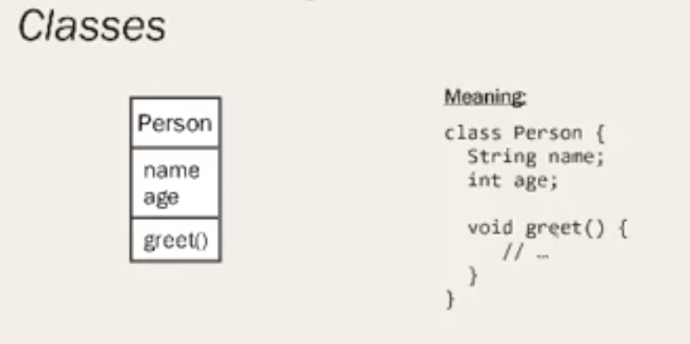
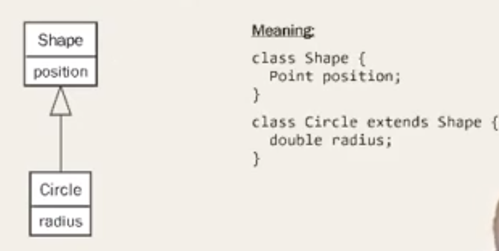
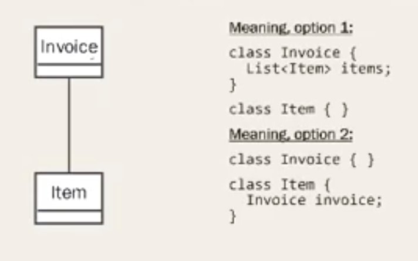
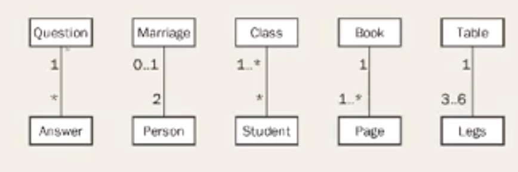
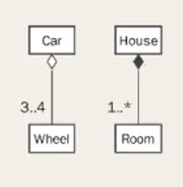

# Class

# Inheritance

# Associations
I.e. something is happening between these two class. Sometime; once contains others. 

# Multiplicity

# Aggregations & Compositions (IS PART OF )
## Aggregation
- Wheel is owned by Car
- Wheel has a lifecycle of it's own
## Composition
- Room is owned by house
- Room is destroyed by house

# Tricks to remember
Go by English
- Student is a person >> Inheritance
- Room is part of house >> composition
- Hide other blocks to find out multiplicity
 